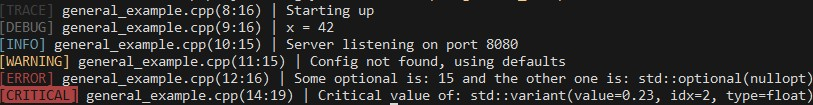

# logzy

A lightweight, header-only C++23 logging library with compile-time log level filtering and colorized terminal output.

## Features

- **Header-only:** just include and go
- **Compile-time log level filtering:** disabled log calls have zero runtime cost
- **Colorized output:** each log level has a distinct color via [rainbowcpp](https://github.com/oosiriiss/rainbowcpp)
- **Source location:** automatically prints file name, line, and column
- **Extended formatters:** built-in `std::formatter` support for `std::optional`, `std::variant`, `std::filesystem::path`, and wide strings
- **C++23:** uses `std::print`, `std::source_location`, `std::format`, and concepts


## Requirements

- C++23 compiler (GCC 15+, Clang 18+, MSVC 19.38+)
- CMake 3.14+

## Installation

**Manually**

Just copy the header files in [include](./include/) directly into your project

**With CMake**

```cmake
include(FetchContent)
FetchContent_Declare(
    logzy
    GIT_REPOSITORY https://github.com/oosiriiss/logzy
    # 0.2.8
    GIT_TAG 7e4a58889a178038f81e21af816474de4cc748aa # or other tag/commithash/branch
)
FetchContent_MakeAvailable(logzy)

target_link_libraries(my_app PRIVATE logzy::logzy)
```

## Usage
```cpp
#include <optional>
#include <variant>
#include "logzy/logzy.hpp"

int main() {  

  logzy::trace("Starting up");
  logzy::debug("x = {}", 42);
  logzy::info("Server listening on port {}", 8080);
  logzy::warn("Config not found, using defaults");
  logzy::error("Some optional is: {} and the other one is: {}",
               std::optional<int>({15}), std::optional<int>{});
  logzy::critical("Critical value of: {}",
                  std::variant<int, long, float>(0.23F));
}
```



For more examples check out the [example](./example/) directory.

## Dependencies
- [rainbowcpp](https://github.com/oosiriiss/rainbowcpp) 

Output format:
